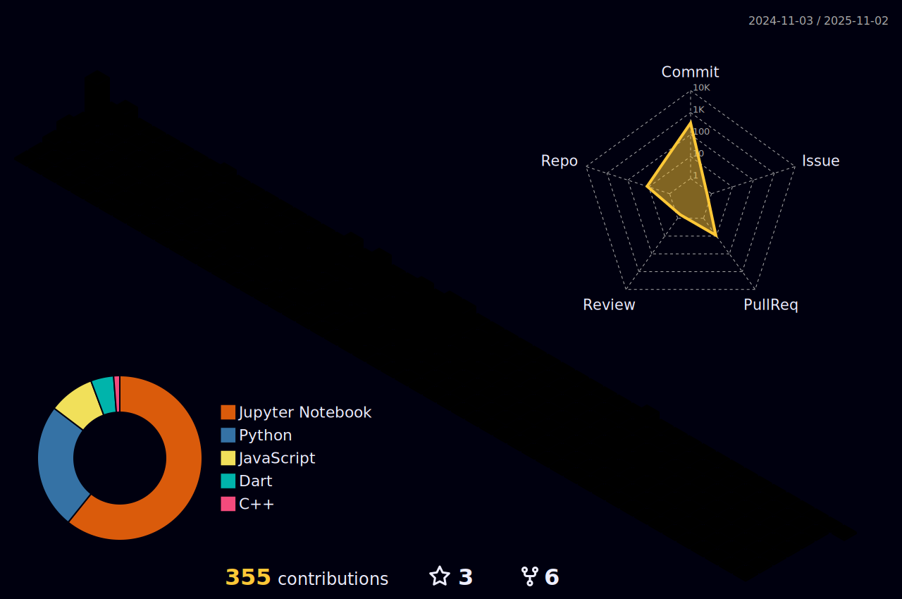

  

<h3 align="center">🛠 Tech Stack 🛠</h3>

  
  
  
  
  
  
  
  
  
  

---

<h3 align="center">👾 BaekJoon 👾</h3>

  
<!--  -->

---

<h3 align="center">📊 Github Stats 📊</h3>

<!--

  
  

-->

  

---

